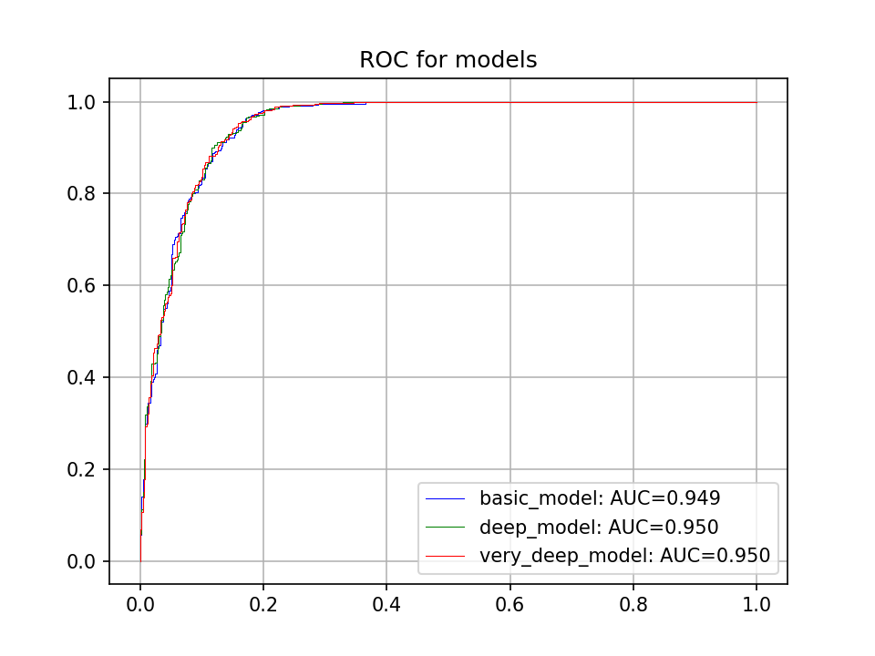

## About
This is educational project for classification stepping stones puzzle instances.
Catboost library is used.

## Motivation
Can be used for building heuristics in combinatorial search algorithms (look at SteppingStonePuzzle repository).

## Usage
Supposed there is a precomputed dataset in following form (output for dfs_engine)
```
Grid: GRID_SIZE, items: NUMBER_OF_STONES, count: NUMBER_OF_INSTANCES
Score: SCORE_1
x11 y11 x12 y12 ...
Score: SCORE_2
x21 y21 x22 ...
...
```
Then .csv dataset with some features can be computed via following command.
```
python3 make_dataset.py --lim LIM_VAL --dataset_half DATASET_HALF_VAL
```
Then one can simply use prepared code in classifier.py:
```
python3 classifier.py --dataset_file stepping_stones_puzzle_dataset.csv --model_params_file models.json
```
or build up its own research scenario based on it.

## Experiments
Author used precomputed database with 13.9M instances sorted by value. 
Dataset was made from random subset of this database with following command.
```
python3 make_dataset.py --lim 25000 --dataset_half 5000
```
In order to make balanced classes 5000 instances were picked from first 25000
and other 5000 instances from the rest. Results are shown on picture.
